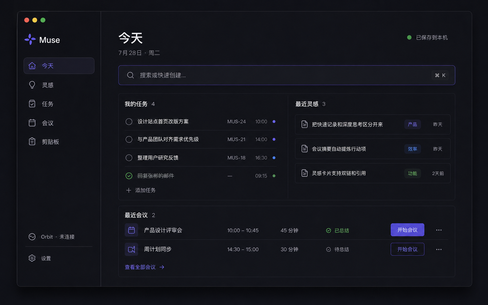
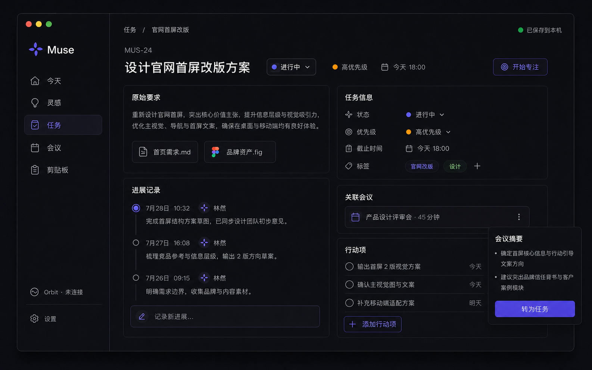
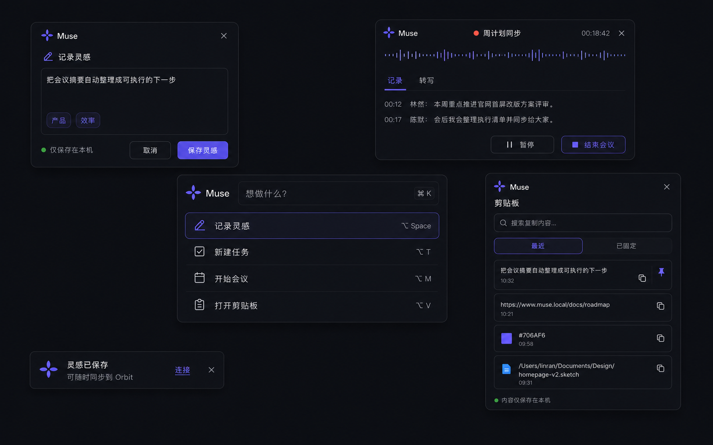
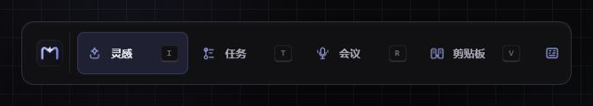
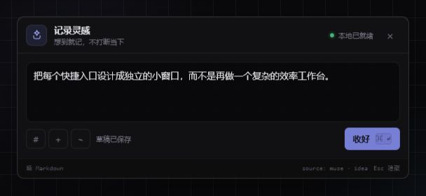
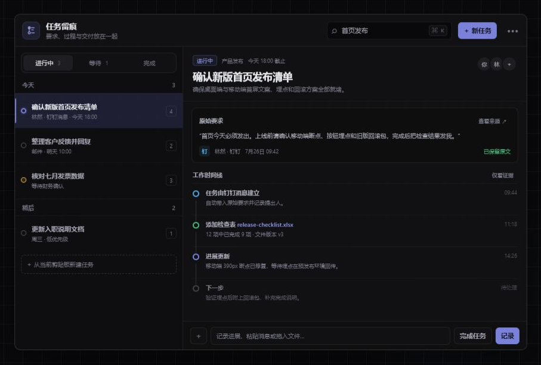
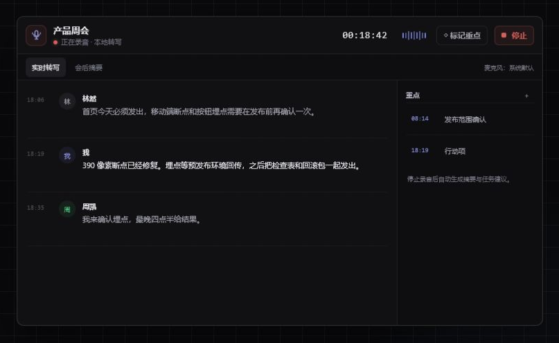
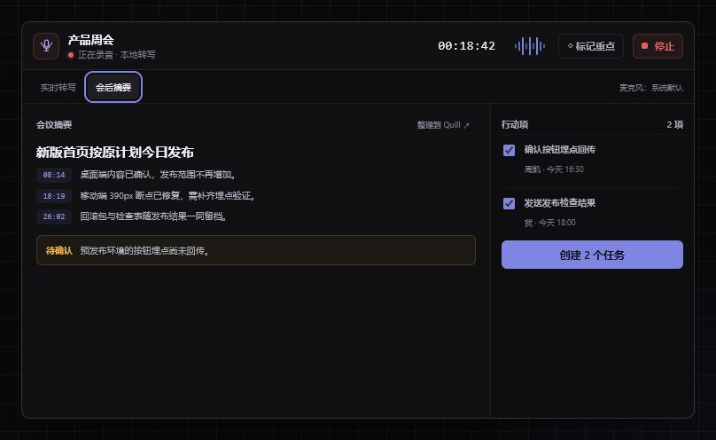
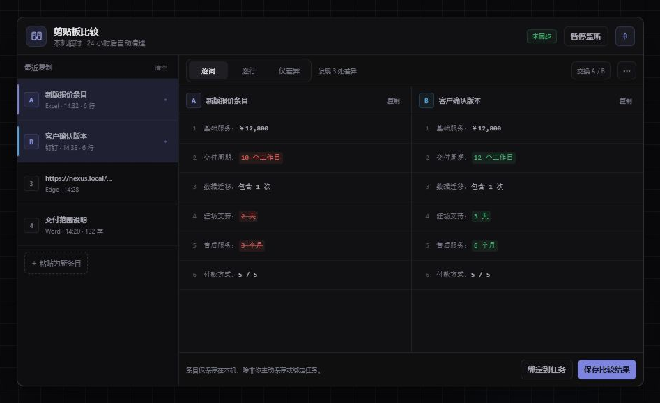
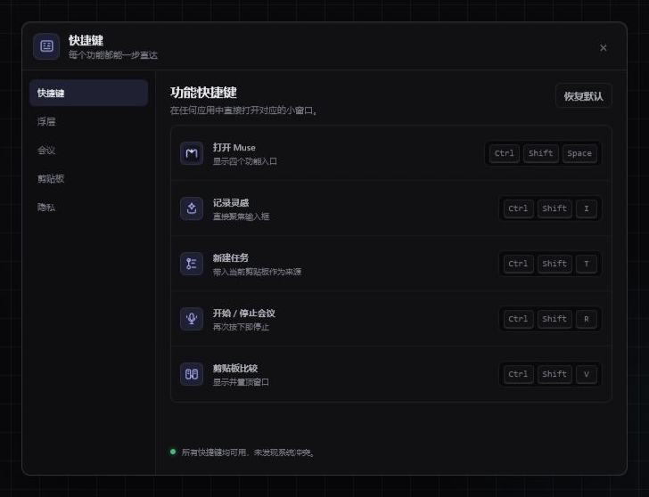

# Muse 界面与图标设计

本目录是 Muse 全面产品化阶段的第一版界面基线。设计目标不是把 Muse 做成另一个复杂工作台，而是让它保持为一个**通过快捷键直达、完成后立即离开的精致小助手**。

对应功能说明见 [`docs/apps/muse.md`](../../docs/apps/muse.md)。

> `index.html` 只是方便评审时切换全部状态的设计展板，不是正式应用的信息架构。正式应用的 `apps/muse/src/pages` 只承担主窗口中的聚合、回看与设置；`apps/muse/src/tool-windows` 才是四个快捷键直接唤起的专用功能界面。

## 1. 设计主张

- **小**：灵感和启动入口使用真正的小浮层；任务、会议、剪贴板只在需要更多上下文时展开。
- **快**：四类高频功能均预留独立快捷键，不要求先进入首页。
- **静**：默认暗色、低对比边框、一个主色动作，不使用大卡片、渐变背景或装饰性数据。
- **可追溯**：任务详情把原始要求、提出人、附件、进展和交付结果放在同一时间线。
- **本地感**：录音和剪贴板明确显示本地状态，临时剪贴板不会自动同步。

## 2. 文件结构

```text
design/muse/
├── index.html                  可交互界面原型
├── muse.css                   完整界面样式与响应式规则
├── muse.js                    页面切换和会议模式交互
├── muse-linear-today.png      Linear 式“今天”主工作区视觉基准
├── muse-linear-task.png       Linear 式任务详情与会议留痕视觉基准
├── muse-linear-tools.png      Linear 式全局快捷工具窗视觉基准
├── icons/
│   ├── muse-app-icon.svg      Muse“星芒 M”应用图标源文件
│   ├── muse-app-icon-*.png    32–1024px PNG 导出
│   ├── idea.svg               灵感
│   ├── task-trace.svg         任务留痕
│   ├── meeting.svg            会议
│   ├── clipboard-compare.svg  剪贴板比较
│   └── hotkeys.svg            快捷键
└── screens/
    ├── muse-launcher.png
    ├── muse-idea.png
    ├── muse-task-trace.png
    ├── muse-meeting-live.png
    ├── muse-meeting-summary.png
    ├── muse-clipboard-compare.png
    └── muse-hotkeys.png
```

## 3. 界面预览

### Linear 式应用基线







这组三张高保真稿是正式应用新一轮重构的视觉基准：使用石墨色工作台、发丝级分隔、紧凑列表和克制的紫蓝焦点，同时保留 Muse 本地优先、键盘优先和独立品牌。正式实现不复刻其他产品的品牌、图标或专有页面。

### 快捷启动条



四个入口同层级展示，字母键提示对应独立快捷功能；最右侧只保留快捷键设置。

### 灵感捕捉



只有标题、输入区、三个轻工具和一个“收好”动作。草稿状态与写入范围退到弱层级。

### 任务与工作留痕



左侧是紧凑任务列表，右侧只呈现选中任务。原始要求独立成证据块，后续文件、进展、完成与复开进入同一时间线。

### 会议录音与摘要





录音页强调计时、状态、实时转写和重点标记；停止后切换为可回链时间戳的摘要与待确认行动项。

### 剪贴板比较



左侧选择复制条目，右侧以等宽双栏突出逐词差异。底部明确提示“仅本机”，并提供绑定任务或主动保存。

### 快捷键设置



五个入口分别绑定，不把快捷键藏在多层设置中；冲突结果在页面底部原位反馈。

## 4. 本地预览

在本目录启动任意静态服务器：

```powershell
python -m http.server 4178 --bind 127.0.0.1
```

然后打开：

```text
http://127.0.0.1:4178/
```

也可以使用查询参数直达界面：

```text
?view=launcher
?view=idea
?view=tasks
?view=meeting
?view=clipboard
?view=settings
```

原型支持：

- 顶部标签切换；
- 启动条直接进入对应功能；
- 会议页切换“实时转写 / 会后摘要”；
- 非输入状态下使用 `I / T / R / V` 快速切换；
- `Esc` 返回快捷启动条。

## 5. 实现映射

正式应用已经拆成一个主窗口和四个独立工具窗：

| 区域 | Tauri 窗口 / React 入口 | 当前首要能力 |
|---|---|---|
| 聚合与设置 | `main` / `src/App.tsx` | 今日聚合、历史查看、详细管理、可选 Orbit 连接 |
| 灵感 | `idea` / `IdeaToolWindow.tsx` | 自动聚焦、本地保存、失焦隐藏 |
| 任务 | `task` / `TaskToolWindow.tsx` | 标题与原始要求一次绑定、生成来源留痕 |
| 会议 | `meeting` / `MeetingToolWindow.tsx` | 计时、文字记录、重点标记；真实录音待接入 |
| 剪贴板 | `clipboard` / `ClipboardToolWindow.tsx` | 主动读取、固定、双栏逐行比较 |

四个窗口分别使用 `?window=idea|task|meeting|clipboard` 进入专用 React 根组件。Tauri 在启动时预创建窗口并用系统级快捷键执行 `show + focus`，工具窗关闭时只隐藏，不再回退到主窗口页面切换。

界面实现继续复用 `@nexus/ui` token；原型中的业务文案与数据仅用于展示，不代表尚未接入的录音、转写或后台剪贴板监听能力已经完成。
